# Guided Project: Personality Quiz

In this unit, you learned about the UIKit framework and its controls. You also learned how to manage the position and size of views and controls using Auto Layout and stack views, while managing the flow of your app using navigation and tab controllers. Now you'll combine all that knowledge to build an app.

For this guided project, you'll create a personality quiz. Maybe you've seen this type of game before. Players are presented with a light-hearted topic and answer questions that align them to a particular outcome. Here are some examples of personality quiz topics:

1. What animal are you? 
2. What country should you visit next? 
3. Which Apple product are you? 

There are no correct answers to quiz questions. Answers are purely subjective, and their results don't even have to be logical. For example, suppose you design a quiz called "What country should you visit next?" You could pose the question "What is your favorite color?" and decide that the answer "green" aligns to Italy and not to France. Other questions and answers might make more sense. If the player prefers sushi over pasta, you could award points for Japan instead of for Italy.

This guided project will use "Which animal are you?" as the quiz topic. The four possible outcomes are: dog, cat, rabbit, and turtle. But if you prefer to choose your own topic and outcomes, go ahead. As long as you're following the steps in the project, any topic is fine. You'll learn more if you're having a good time.

## Part One—Project Planning

Rather than diving directly into Interface Builder or Swift, it's important to think about the goals and requirements of your personality quiz. Who's your target audience? Maybe you have a topic in mind, but what features will the quiz include? What models and views will you need to accomplish those features?

「If you try to dig into writing code before you've thought through those questions, you'll probably end up rewriting or throwing away a lot of work. Spend some time now to plan your project and consider how best to approach it. 」

### Features

「What features are required to produce a fun personality quiz? Since this is probably your first app of this type, keep the list short. At a minimum, the app should accomplish three main goals: 」

1. Introduce the player to the quiz.
2. Present questions and answers
3. Display the results.

### Workflow

「With those three goals in mind, try to imagine your app as a series of related views. Each feature is very distinct from the other two, so each deserves its own screen. Some type of input will move the player from one feature to the next. For example, you can include a "Begin Quiz" button to move the player from the introduction to the questions, and answering the final question can transition to displaying the results. For the purposes of this project, you'll need at least three view controllers—one to present each of the three features. 」

「Did you also think about presenting a new view controller for each question? That's not actually necessary. In earlier lessons, you learned about two methods of presenting view controllers—modally or with a push onto a navigation stack. A modally presented screen typically includes a way to be dismissed, and any new view controller you push on a navigation controller has a Back button in the upper-left corner. In either case, there's always an implied method of dismissal. 」

「What would happen if you had separate view controllers for each question? Imagine a player is on the ninth question and wants to return to the third question. If you had a view controller for every question, they would have to dismiss six view controllers to go back. That's ok, but then they'd have to answer the questions in between—all over again—to return to the ninth question. 」

「n this project, you'll update a single screen that can present all your questions, rather than presenting questions on separate screens.」

### Controllers

「Every UIViewController subclass you create is, in fact, a controller. A view controller uses the data model you've defined to control the view that's displayed on the screen. As your apps grow in complexity, you can create additional controllers to manage the model data, freeing up the view controller to focus only on view-related code. However, since this personality quiz has just three screens that contain very simple content, your view controllers can handle managing the data. 」

### Views

「Depending on your quiz topic and the questions you want to ask, your personality quiz may need different input controls. Consider the following questions: 」

* Which food do you like the most? 
* Which of the following foods do you like?
* How much do you like this particular food? 

「The first question is a multiple-choice question, where only one answer is valid. For this question, you could use a button for each food. The second question can have zero or more answers. You could use switches so that the player can select as many foods as they like, as well as a button to submit their choices. The third question might involve a 1-to-10 scale using a slider. 」

「As you can see, the type of question dictates the controls that will be displayed onscreen. With a single view controller for all the questions and answers in your quiz, you'll want to display only the buttons, switches, slider, and/or labels that match the current question. The simplest and best way to do this is to group the controls within a view that corresponds to the question type. The appropriate view—for single-answer, multiple-answer, or ranged response—can then be shown or hidden. 」

### Models

「What type of data do you need for a personality quiz? At first, you might consider creating an array of strings to hold your questions, but where would you store the answers? A better idea would be to create a Question struct that holds a collection of answers. The collection of answers also needs to be more than an array of strings, because each answer will correspond to one of the quiz outcomes. At the very least, you'll want to include a Question struct, an Answer struct, and some sort of result type. 」

「Consider the result type. In a personality quiz, an answer can correspond to only one outcome. For example, in the animal quiz, the result will never be a dog and a cat; it will be one or the other. This is the perfect use case for an enumeration. In the same way that a Direction enumeration might have north, south, east, and west cases, the AnimalType can be dog, cat, rabbit, or turtle. If you've forgotten the details of using an enum, take a fresh look at the "Enumerations" lesson in Unit 2. 」

### Quick Overview

Now that you've analyzed which components you'll need, it's probably easier to see how the project will come together. You'll use three view controllers for your quiz:

* The first is an introduction screen with information about the quiz and a button to begin. 
* The second view controller displays a question and several answers, and manages the responses. This view controller is refreshed for each question, and depending on what kind of question you ask, the right controls will be displayed. 
* 「The third view controller tallies up the answers and presents the final outcome. This result can be dismissed, allowing another player to start the quiz from the first view controller. 」


## Part Two—Project Setup

「Create a new project using the Single View Application template. Name it "PersonalityQuiz," and open Main.storyboard. The storyboard already contains one view controller, but you'll need two more. Drag two view controllers from the Object library onto the canvas, and position all three in a horizontal row. 」

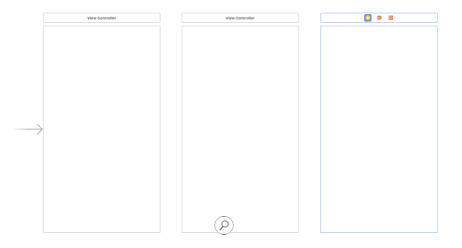

### Create the Introduction Screen

「The first view controller will invite the player to take your quiz. At a minimum, it needs to include a label that introduces the quiz and a button to begin. Beyond these simple requirements, the design of the screen is entirely up to you. 」

「As an example, take a look at the introduction screen below, then follow the instructions to learn how to build it. You can use the same screen, or something similar, as long as the topic of the quiz is clear to the player. 」

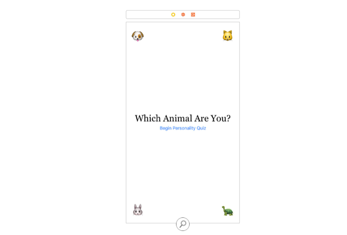

「Add a label from the Object library onto the view controller, then add a button just below the label. With the label selected, use the Attributes inspector to change the label's text, text color, and font. In the screenshot above, the text reads "Which Animal Are You?" using the Georgia font Regular 30.0. Select the button and update the title to read "Begin Personality Quiz" using the System font 15.0. 」

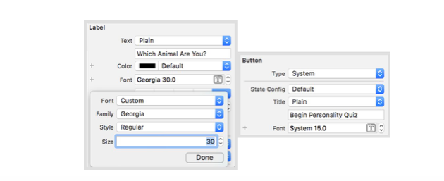

「Whenever you have multiple items in a horizontal row or a vertical column, it's a good idea to use a stack view. This approach will reduce the number of constraints you'll need to create and manage. 」

「Highlight both the label and the button, and click the Embed In Stack button . With the stack still selected, use the Attributes inspector to check that the Axis is set to Vertical, and set both the Alignment and Distribution to Fill. These settings will ensure that elements in the stack are positioned vertically and that they fill all available space along the stack view's axis. 」

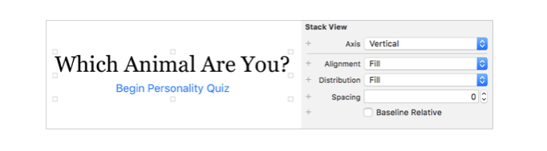

「Use the Align tool to add constraints that center the stack view vertically and horizontally within the view. Click "Add 2 Constraints." 」

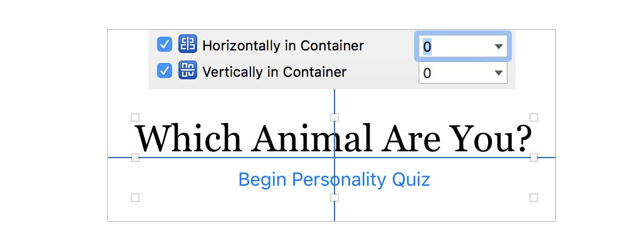

「That's all that's necessary for an introduction screen, but it's a little boring. What are the possible outcomes? For this topic, it would be fun to add an emoji for each animal \(dog, cat, rabbit, and turtle\) and position them in the four corners of the view. If there aren't any emoji that fit your particular quiz topic, consider using images in place of emoji text. 」

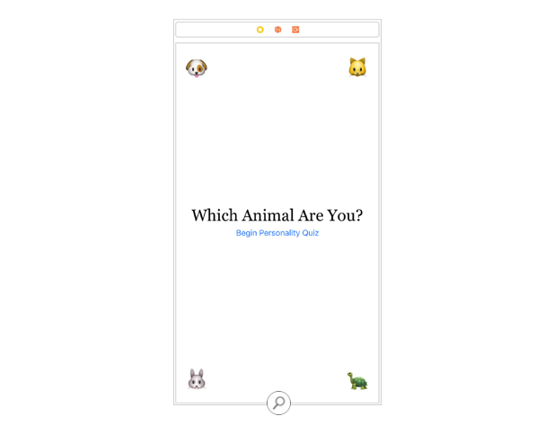

「Drag four more labels from the Object library onto the view, and replace the text with the emoji for each animal. To bring up the emoji picker, highlight the label text in the Attributes inspector, then press Control-Command-Space. Enlarge all the emoji by setting the Font to System 40.0. Finally, use the blue layout guides to place each label in a corner with the recommended margins.」

「To hold your emoji in their respective corners on all screen sizes, you'll need to add two constraints to each label. Begin by selecting the top-left label and clicking the Add New Constraints button. Enable the top and leading constraints and set them both to 0 pixels, ensuring there's no space between the edges of the label and the margins of the view. By default, the top of a view has a 20-pixel margin, and the left and right sides have 16 pixels of margin. So when you enter 0 pixels, you're actually telling the label to position itself 20 pixels from the top and 16 pixels from the left edge of the view. Add these two constraints.」

「The position of your top-left emoji is all set. Now repeat the steps for the other three labels, using the appropriate edges to create constraints. Check out the four Add New Constraints tool values, from left to right in the diagram below, for the dog, cat, rabbit, and turtle labels. 」

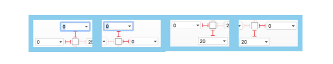

「Along the way, after positioning and adding constraints, you might notice some yellow warnings. That's OK. Click the Update Frames button, near the bottom of Interface Builder, to readjust the position and size of your views to match the constraints you've created. 」

「At this point, your labels are good. What about the button? When the button is tapped, you want it to modally present the screen that displays the questions. To make this happen, Control-drag from the button to the next view controller, and create a Show segue. Since the view controller you're customizing isn't contained in a navigation controller, the Show segue will adapt to present the next view controller modally. 」

### Create the Question-and-Answer Screen

「he second view controller will display each question, one at a time, along with input controls that allow the player to respond. The controls you use—buttons, switches, or sliders—need to make sense for the questions and answers in your quiz. You'll think through the controls a bit later in the project. 」

「After the player has answered a question, your app will need to make a decision: 」

* If there's another question in the quiz, update the labels and controls in the view controller accordingly.
* If there are no more questions, display the results in a new view controller. 

「How will the app know what to do? You'll need to create some logic that determines whether or not to make a segue after receiving an answer to the current question. If you were to create a segue by Control-dragging from the input control to the next view controller, it would force the segue to take place whenever the player interacts with the control. 」

「Instead, you can invoke a segue programmatically between the second and third view controllers. Control-drag from the view controller icon, above the second view controller's view, to the third view controller, and create a Show segue. Highlight the segue in the storyboard, then use the Attributes inspector to give it an identifier string, "ResultsSegue.」

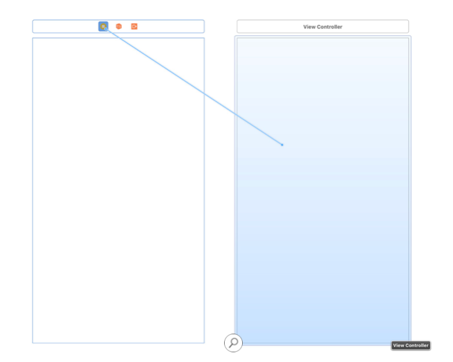

「As you've already learned, when you embed the root view controller in a navigation controller, the Show segue will adapt from a modal presentation to a right-to-left push. In your quiz, when the player has answered the last question, you can push to the final view controller to display the results. 」

「Should all three view controllers be contained in a navigation controller? Remember that a modal presentation is the right choice whenever the context of your app will change. And it's a context shift when the player transitions from the introduction screen to the question screen. That means that the first view controller should modally present a view controller contained in a navigation controller. Select the second view controller, then choose Editor &gt; Embed In &gt; Navigation Controller from the Xcode menu bar. 」

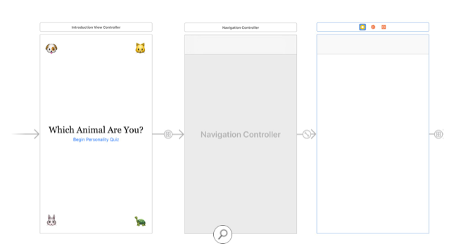

### Create the Results Screen

「After the player has finished the quiz, the app will display the results, along with a short description. The player should have some way to dismiss the results and return to the introduction screen so that another player can take the quiz. Here's an example of this interface: 」

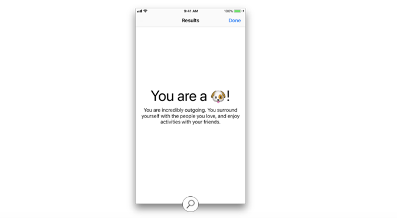

「Now that you've embedded the results screen in a navigation controller, a navigation bar is available for placing titles and buttons—as long as the view controller has a navigation item. You'll add that now.」

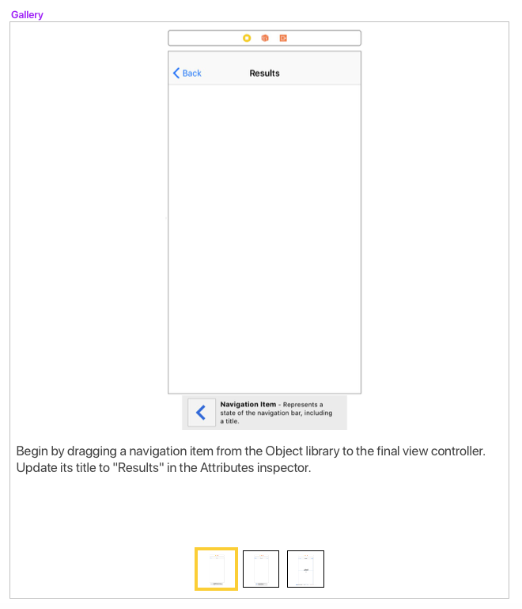

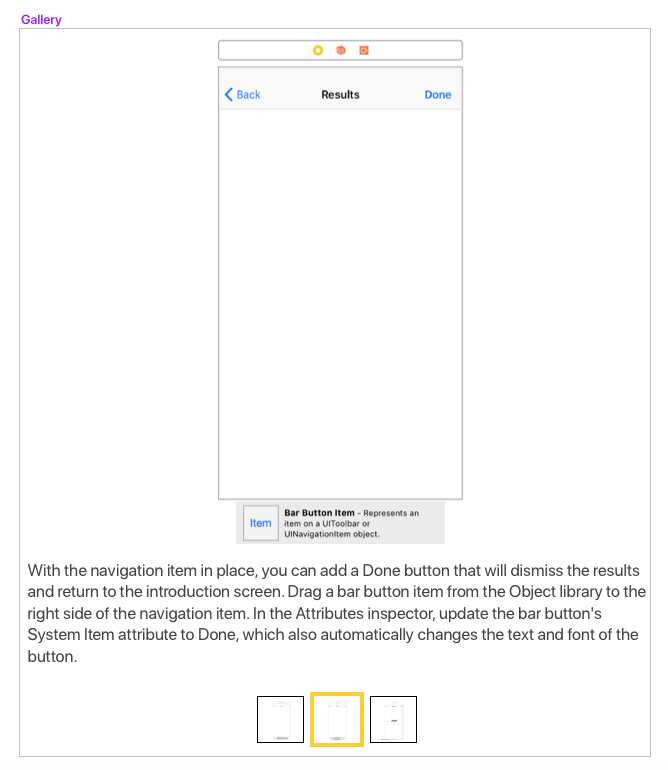

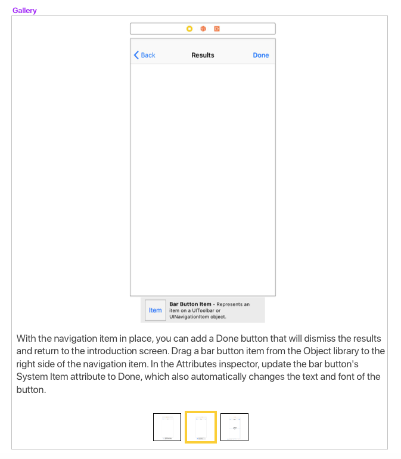

### Create Descriptive Subclasses

「Now that you have three view controllers in your storyboard scene, you'll need three UIViewController subclasses in code. Create a new file by choosing File &gt; New &gt; File from the Xcode menu bar. Select Cocoa Touch Class as your starting template, then choose UIViewController from the Subclass pop-up menu. This choice will automatically append "ViewController" to the class name, making the object's type clear to other developers. Name the class "QuestionViewController" and click Next. The Group pop-up menu should list a folder that matches the name of the project, PersonalityQuiz. Choose it and click Create. 」

「Repeat these steps to create a second class, naming it "ResultsViewController." When you're finished, you'll see two new files in the project navigator for your quiz. 」

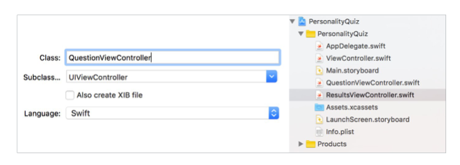

「You might also notice that the project navigator lists a subclass of UIViewController called "ViewController." The Single View Application template automatically assigned this name to your app's first view controller. To be more descriptive, click the filename and change it to "IntroductionViewController.swift." Next open the file and change the class name to "IntroductionViewController," then close the file. 」

「Now your project has three descriptively named UIViewController subclasses. Reopen Main.storyboard. One at a time, select each view controller and use the Identity inspector to assign it the appropriate custom class. The first view controller will be IntroductionViewController, followed by the QuestionViewController and ResultsViewController. 」

## Part Three—Create Questions and Answers

「During the project planning phase, you considered three different question types: single-answer, multiple-answer, and ranged response. Now take some time to come up with your list of questions. Think about how you can reword each question to fit one of the three categories. 」

### Single-Answer Questions

「Suppose you ask "Which food do you like the most?" The answer might include a list of four foods, and the player must pick one. What kind of control would you use? A simple approach would be to present a button for each answer, organized in a vertical stack view.」

「Begin by dragging a vertical stack view from the Object library to the QuestionViewController. Now add four buttons to the stack view. Use the Align tool to center the stack vertically within the view, then use the Add New Constraints tool to set its leading edges to 0 pixels. Add space between the buttons by setting Spacing to 20 in the Attributes inspector. If necessary, click the Update Frames button to reposition the stack based on the constraints you've created.」

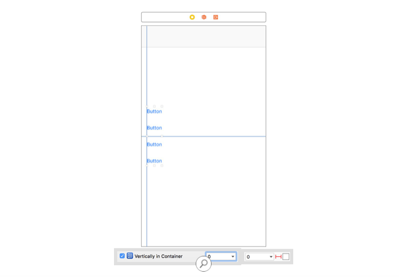

「Of course, the button titles will change based on the answers you provide. You'll update them later, when you move on to coding the quiz. 」

### Multiple-Answer Questions

「The question "Which of the following foods do you like?" suggests that the player can choose multiple answers. Rather than using buttons for the answers, it would make more sense to create pairs of labels and switches—so the player can switch on all positive answers. When the player has made their selections, they can tap a button to submit the answers and move on to the next question. 」

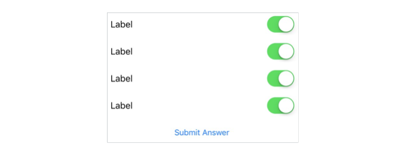

「Before you begin, you might want to hide the single-answer stack view. Select the stack in the storyboard or the outline, then open the Attributes inspector, and deselect Installed at the bottom of the pane. 」

「The switch UI is not much different from the button UI. Each label-and-switch pair can be held in a horizontal stack view. And just like the single-answer question, the rows can be held in a vertical stack view. 」

「Begin by adding a label and a switch from the Object library. Highlight both of them, then click the Embed In Stack button . In the Attributes inspector for the stack view, make sure that the Axis is set to Horizontal and that Alignment and Distribution are both set to Fill.」


「Select the stack view, then copy \(Command-C\) and paste \(Command-V\) it to add three copies to the view. Now select all four horizontal stacks, and click the Embed in Stack button to place them in another stack view. In the Attributes inspector for this new stack view, ensure that the Axis is set to Vertical, set the Alignment and Distribution to Fill, and set the Spacing between elements to 20. 」


「Add a button to the bottom of the stack view, and set its title to "Submit Answer." Finally, use the Align tool to center the stack vertically within the view, then use the Add New Constraints tool to set the leading and trailing edges to 0 pixels from each margin. If necessary, use the Update Frames button to reposition the frames based on the constraints you just created.」

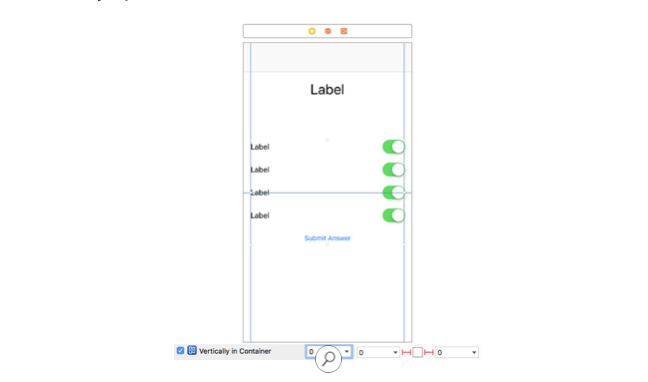

### Range Questions

「The third type of question might follow this format: "How much do you like this particular food?" You could probably think of a way to use a button or a switch for the answer, but the player might have a better experience if their choice feels a little more freeform. To allow the player a range of answers, you could use a slider as the input control, with a label on either end of the slider. 」

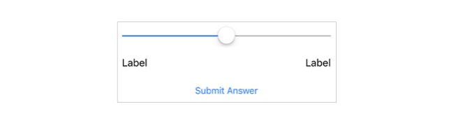

「To make things easier, you might want to hide the multiple-answer stack, just as you did earlier with the single-answer stack. Select it in the storyboard, open the Attributes inspector, and deselect Installed at the bottom of the pane. 」

「You can use stack views to create this interface without having to define very many constraints—similar to the switch approach. Begin by adding two labels to the canvas from the Object library, then select both and click Embed In Stack . In the Attributes inspector, check that the Axis is set to Horizontal, Alignment is set to Fill, and Distribution is set to Equal Spacing. 」


「Next, drag a slider from the Object library onto the canvas. Select the slider and the horizontal stack, then click Embed in Stack. In the Attributes inspector, check that the Axis is set to Vertical, the Alignment and Distribution are both set to Fill, and the Spacing is set to 20.」


「Add a button to the bottom of the stack, and set its title to "Submit Answer". Use the Align tool to center the stack vertically within the view, then use the Add New Constraints tool to align the leading and trailing edges with 0 pixels of spacing to each margin. If necessary, use the Update Frames button to reposition the frames based on the constraints you've created. 」

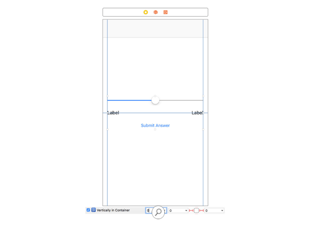

「Before you move on, you'll need to re-enable the stack views that you uninstalled during the building process. In the document outline, select each stack view, then select the Installed checkbox in the Attributes inspector. 」

### Question Label and Progress

「No matter what kind of question you ask your players, you'll need to display it in a label. Add a label to the top of the view, then use the Add New Constraints tool to position the label 20 pixels below the navigation bar and 0 pixels from the leading and trailing margins. In the Attributes inspector, set the text alignment to center, and set the font to System Font 32.0. Set the Lines attributes to 0, which will allow the label to use as many lines as it needs. Change the Line Break attribute to Word Wrap.」

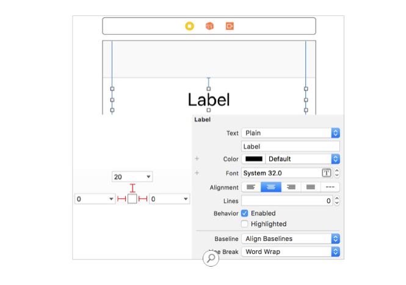

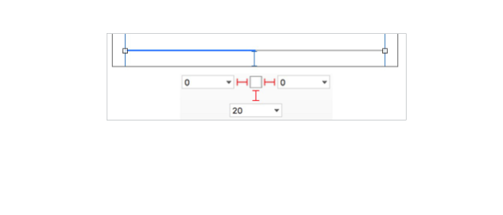

「Players often like to know how far along they are in the quiz. Search for "Progress View" in the Object library, and add it to the view. Use the Add New Constraints tool to position the progress view 20 pixels from the bottom and 0 pixels from the leading and trailing margins of the view. 」


## Part Four—Models and Outlets

摘錄自: Apple Education. 「App Development with Swift」。 Apple Inc. - Education，2017. iBooks. [https://itunes.apple.com/tw/book/app-development-with-swift/id1219117996?mt=11](https://itunes.apple.com/tw/book/app-development-with-swift/id1219117996?mt=11)


「So far in this lesson, you've designed the view controllers in the storyboard, and you've got three UIViewController subclasses ready to receive some code. Now it's time to create structures that hold the question data and to update the user interface based on the values of each question and its answers. Once the data has been laid out, you can update the user interface based on which question is being displayed. 」

### Data Models

「Begin by creating a new file called QuestionData.swift to house the model definitions. You'll use this file to define all the structures necessary for your personality quiz. You can create this file by selecting File &gt; New &gt; File \(or Command-N\) from the Xcode menu bar, then selecting "Swift file." 」

「It's safe to assume that every Question will have text to represent the question itself, along with an array of Answer objects. Since your quiz can use three different types of input methods, you'll create an enum that describes the question's response type: single-answer, multiple-answer, or ranged response. An example of the structure is shown below: 」

```swift
struct Question {
    var text: String
    var type: ResponseType
    var answers: [Answer]
}

enum ResponseType {
    case single, multiple, ranged
}
```

「Every answer corresponds to a result type. In the animal example, suppose you ask "Which of these foods do you like the most?" and the possible answers are: "Steak," "Fish," "Carrots," and "Corn." Each response corresponds to a dog, cat, rabbit, and turtle, respectively—and therefore, to a particular emoji. If the answers property was an array of strings, there wouldn't be a simple way to associate an answer with a particular result. 」

「Instead, an Answer struct will have a string to display to the player and a type property that ties the answer to a specific result.」

「Here's an example of the data:」


```swift
struct Answer {
    var text: String
    var type: AnimalType
}
 
enum AnimalType: Character {
    case dog = "🐶", cat = "🐱", rabbit = "🐰", turtle = "🐢"
}
```

「Typically at the end of a personality quiz, the player receives some text about the outcome of the quiz. Since you've already defined an enum to represent each personality type—or in this case, animal type—you could include a definition property that will be presented as a label on the results screen. 」

「Here's an example of a definition for the animal types: 」


```swift
enum AnimalType: Character {
    case dog = "🐶", cat = "🐱", rabbit = "🐰", turtle = "🐢"
 
    var definition: String {
        switch self {
        case .dog:
            return "You are incredibly outgoing. You surround
            yourself with the people you love and enjoy 
            activities with your friends."
        case .cat:
            return "Mischievous, yet mild-tempered, you enjoy
            doing things on your own terms."
        case .rabbit:
            return "You love everything that's soft. You are
            healthy and full of energy."
        case .turtle:
            return "You are wise beyond your years, and you
            focus on the details. Slow and steady wins the race."
        }
    }
}
```

### Display Questions and Answers

「The QuestionViewController will hold the array of Question objects in a property called questions. As you create the objects, you'll need to take special care with how many Answer objects you place in the answers property. When you built stack views for single- and multiple-answer responses, you created four buttons and four switches to represent a static number of possible answers. So any Question you create with a type property that's set to single or multiple must have exactly four Answer objects. 」

「For the ranged response, you can get away with only two answers: the two ends of the slider. But it would be better to define four possible ranges so that the question can give points to each of the four outcomes. The collection of answers for a ranged response needs to be in some sort of order—from least likely to most likely, for example—so that you can accurately assign the answers to a result. 」

「In the example below, the array is filled with a question of each response type: single-answer, multiple-answer, and ranged response:」


```swift
var questions: [Question] = [
    Question(text: "Which food do you like the most?",
             type:.single,
             answers: [
                Answer(text: "Steak", type: .dog),
                Answer(text: "Fish", type: .cat),
                Answer(text: "Carrots", type: .rabbit),
                Answer(text: "Corn", type: .turtle)
                      ]),
    Question(text: "Which activities do you enjoy?",
             type: .multiple,
             answers: [
                Answer(text: "Swimming", type: .turtle),
                Answer(text: "Sleeping", type: .cat),
                Answer(text: "Cuddling", type: .rabbit),
                Answer(text: "Eating", type: .dog)
                      ]),
    Question(text: "How much do you enjoy car rides?",
             type: .ranged,
             answers: [
                Answer(text: "I dislike them", type: .cat),
                Answer(text: "I get a little nervous",
                      type: .rabbit),
                Answer(text: "I barely notice them",
                      type: .turtle),
                Answer(text: "I love them", type: .dog)
                     ])
]
```

### Display Questions with the Right Controls

「Now that you have a list of questions to draw from, you'll need to keep track of which ones your app has already displayed and to calculate when you've displayed them all. One technique is to use an integer as an index into the questions collection. This integer will start at 0 \(the index of the first element in a collection\), and you'll increment the value by 1 after the player answers each question. 」

「Add a property called questionIndex to your QuestionViewController: 」


```swift
var questionIndex = 0
```

「As the player moves from question to question, you'll need to show the correct stack view and to hide the other two. But before you can write code that changes the stack view's visibility, you'll need to create the necessary outlets and actions. 」

「Open Main.storyboard and select QuestionViewController, then open the assistant editor to view QuestionViewController.swift alongside the storyboard. Control-drag from the single-answer stack view to the definition of the 」

「QuestionViewController class, then release the mouse or trackpad to bring up the popover. Verify that the Connection type is set to Outlet, then enter "singleStackView" into the Name field and click Connect. Repeat these steps two more times, entering the names multipleStackView for the multiple-answer stack and rangedStackView for the ranged stack. 」


「Next, create a reusable method, called updateUI\(\), that you can call before displaying each question to the player. You should call this method in viewDidLoad\(\) to set the proper interface for the first question. 」


```swift
override func viewDidLoad() {
    super.viewDidLoad()
    updateUI()
}
 
func updateUI() {
 
}
```

「The updateUI\(\) method is responsible for updating a few key pieces of the interface, including the title in the navigation bar and the visibility of the stack views. You can use the questionIndex property to create a unique title—for example, "Question \#4"—in the navigation item for each question. With the stack views, it's easiest if you hide all three stack views, then inspect the type property of the Question to determine which stack should be visible」

「You can use the questionIndex property in conjunction with the questions collection to access the particular question:」


```swift
func updateUI() {
    singleStackView.isHidden = true
    multipleStackView.isHidden = true
    rangedStackView.isHidden = true
 
    navigationItem.title = "Question #\(questionIndex+1)"
 
    let currentQuestion = questions[questionIndex]
 
    switch currentQuestion.type {
    case .single:
        singleStackView.isHidden = false
    case .multiple:
        multipleStackView.isHidden = false
    case .ranged:
        rangedStackView.isHidden = false
    }
}
```

「Build and run your app. If you've set everything up properly, the stack view that's visible should correspond to the first question you defined in the questions property. Try reordering the questions to test each interface. 」

### Update the Buttons and Label Text 

「The interface on your question screen works, but you still need to update the button titles and label text. To make this happen, you'll need to create outlets for the labels and buttons associated with each stack view. 」

「In addition to the outlets you created for the stack views, this screen requires 12 outlets for the controls and labels. There are four button outlets in the single-answer stack view, four label outlets in the multiple-answer stack view, and two label outlets in the ranged response stack view. You also have the label that displays the question text near the top of the screen, and the progress view near the bottom. 」

「When you create a large number of outlets, it's important to use concise, easily recognizable variable names—and to keep the variable declarations organized near their corresponding stack view outlet. The code below provides an example of good variable names and outlet organization: 」


```swift
@IBOutlet weak var questionLabel: UILabel!
 
@IBOutlet weak var singleStackView: UIStackView!
@IBOutlet weak var singleButton1: UIButton!
@IBOutlet weak var singleButton2: UIButton!
@IBOutlet weak var singleButton3: UIButton!
@IBOutlet weak var singleButton4: UIButton!
 
 
@IBOutlet weak var multipleStackView: UIStackView!
@IBOutlet weak var multiLabel1: UILabel!
@IBOutlet weak var multiLabel2: UILabel!
@IBOutlet weak var multiLabel3: UILabel!
@IBOutlet weak var multiLabel4: UILabel!
 
 
@IBOutlet weak var rangedStackView: UIStackView!
@IBOutlet weak var rangedLabel1: UILabel!
@IBOutlet weak var rangedLabel2: UILabel!」
@IBOutlet weak var questionProgressView: UIProgressView!
```

「Go ahead and create the outlets above. Since the screen has so many controls overlapping one another, you'll probably find it's easier to Control-drag from the item in the document outline to the view controller definition, rather than Control-dragging from the item on the canvas」

「With the outlets in place, you can update each of the controls in the updateUI\(\) method. Two of the outlets, questionLabel and questionProgressView, will need to be updated with every new question. The label and button outlets need to be updated only if their related stack view will be displayed. 」

「For the question label, assign its text to the current question string. For the progress view, calculate the percentage progress by dividing the questionIndex by the total number of questions. To keep the switch statement concise, you can refactor the updates to stack-specific controls in their own methods」


```swift
func updateUI() {
    singleStackView.isHidden = true
    multipleStackView.isHidden = true
    rangedStackView.isHidden = true
 
    let currentQuestion = questions[questionIndex]
    let currentAnswers = currentQuestion.answers
    let totalProgress = Float(questionIndex) /
        Float(questions.count)
 
    navigationItem.title = "Question #\(questionIndex+1)"
    questionLabel.text = currentQuestion.text
    questionProgressView.setProgress(totalProgress, animated:
        true)
 
    switch currentQuestion.type {
    case .single:
        updateSingleStack(using: currentAnswers)
    case .multiple:
        updateMultipleStack(using: currentAnswers)
    case .ranged:
        updateRangedStack(using: currentAnswers)
    }
}
```

「In the single-answer stack view, each button title corresponds to an answer. Use the setTitle\(\_:for:\) method to update the title. The first button will use the first answer string, the second button will use the second answer string, and so on.」


```swift
func updateSingleStack(using answers: [Answer]) {
    singleStackView.isHidden = false
    singleButton1.setTitle(answers[0].text, for: .normal)
    singleButton2.setTitle(answers[1].text, for: .normal)
    singleButton3.setTitle(answers[2].text, for: .normal)
    singleButton4.setTitle(answers[3].text, for: .normal)
}
```

「Similarly, in the multiple-answer stack view, each label's text corresponds to an answer. Set the text property of the first label to the first answer string, and repeat for the other three labels. 」


```swift
func updateMultipleStack(using answers: [Answer]) {
    multipleStackView.isHidden = false
    multiLabel1.text = answers[0].text
    multiLabel2.text = answers[1].text
    multiLabel3.text = answers[2].text
    multiLabel4.text = answers[3].text
}
```

「For the ranged response, you'll need to set up the stack view a bit differently. While there are only two labels to update, the quiz will work better if every question has four answers \(even though only two answers are required\). 」

「Since the number of answers isn't guaranteed, it wouldn't be safe to index directly into the collection. For example, if you used answers\[3\] to access the fourth element of answers, but the collection contained only two Answer structs, the program would crash. 」

「No matter how many answers you have for your ranged response question, the first and last properties of the collection allow you to safely access the two Answer structs that correspond to the labels. 」


```swift
func updateRangedStack(using answers: [Answer]) {
    rangedStackView.isHidden = false
    rangedLabel1.text = answers.first?.text
    rangedLabel2.text = answers.last?.text
}
```

「Build and run your app. The labels and buttons should all update to reflect the first question. Great work! If you see controls that aren't updating, use the Connections inspector for QuestionViewController to verify that you've created each IBOutlet properly. Hover over every item in the list to check their outlets, and—if necessary—break any incorrect outlets. 」

### Retrieve Answers with Actions

「So far, you've generated a list of questions, and your app is displaying the correct user interface for the first question. That's an excellent start. In this section, you'll record the player's answers and move to the next question. When the player has answered every question in the collection, you'll present the results screen. 」

「No matter which set of controls you use, you'll need to initialize an empty collection that can store the player's answers.」


```swift
var answersChosen: [Answer] = []
```

「In the single-answer stack view, you'll determine which outcome each tapped button corresponds to, append it to the collection, then move on to the next question. All four buttons will perform the same work, so you can create one IBAction that any of the four buttons will call when tapped. 」

「Begin by Control-dragging from the first button in the single-answer stack view to a space within the QuizViewController class definition. This is the same way you created an IBOutlet, but this time you'll change the Connection type to Action. Name the method "singleAnswerButtonPressed" and change the Type from Any to UIButton—so that the sender parameter of the method will be of type UIButton. 」


「Connect the three remaining buttons in the single-answer stack view to this newly created IBAction. 」

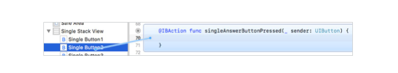

「Why do you need to update the type? You're tying the tap from multiple buttons to this one action, so you'll need to specify which button triggered the method. You can use == to compare two UIButton objects. If the method was triggered using singleButton1, the app will know that the player selected the first answer. 」


```swift
@IBAction func singleAnswerButtonPressed(_ sender: UIButton) {
    let currentAnswers = questions[questionIndex].answers
 
    switch sender {
    case singleButton1:
        answersChosen.append(currentAnswers[0])
    case singleButton2:
        answersChosen.append(currentAnswers[1])
    case singleButton3:
        answersChosen.append(currentAnswers[2])
    case singleButton4:
        answersChosen.append(currentAnswers[3])
    default:
        break
    }
 
    nextQuestion()
}
```

「For the multiple-answer user interface, you'll determine which answers to add to the collection based on the switches the player has enabled. Control-drag from the Submit Answer button to code, and create an action with the name "multipleAnswerButtonPressed." Go ahead and change the Arguments attribute to None, since you don't need the button to determine which answers were chosen.」

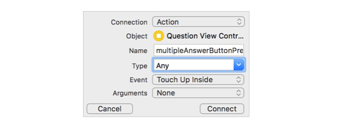

「Next, create four outlets, one for each UISwitch, so that you can check which are enabled and then add those answers to the collection. Control-drag from each UISwitch in the document outline to code, and give each switch a name. To keep your code neat and organized, enter the code for each of these outlets near the label variables associated with the multiple-answer stack view. 」


```swift
@IBOutlet weak var multiSwitch1: UISwitch!
@IBOutlet weak var multiSwitch2: UISwitch!
@IBOutlet weak var multiSwitch3: UISwitch!
@IBOutlet weak var multiSwitch4: UISwitch!
```

「If the first switch is enabled, you want to add the first answer. Unlike the method with single-answer questions, this method allows you to append as many as four answers per question.」


```swift
@IBAction func multipleAnswerButtonPressed() {
    let currentAnswers = questions[questionIndex].answers
 
    if multiSwitch1.isOn {
        answersChosen.append(currentAnswers[0])
    }
    if multiSwitch2.isOn {
        answersChosen.append(currentAnswers[1])
    }
    if multiSwitch3.isOn {
        answersChosen.append(currentAnswers[2])
    }
    if multiSwitch4.isOn {
        answersChosen.append(currentAnswers[3])
    }
 
    nextQuestion()
} 
```

「For a ranged response question, you'll read the current position of the UISlider and use that value to determine which answer to add to the collection. Control-drag from the Submit Answer button to code, and create an action with the name "rangedAnswerButtonPressed." Again, change the Arguments attribute to None.」

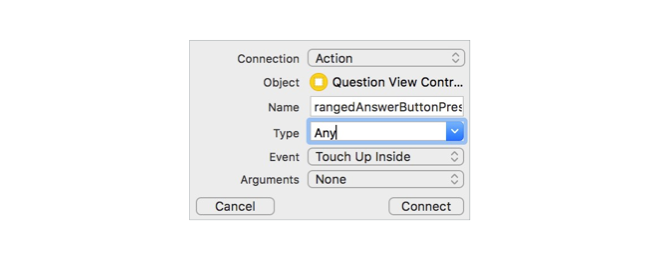

「Next, create an IBOutlet for the UISlider. Control-drag from the slider in the document outline to code and give it a name. As you did in earlier steps, place the code for this outlet near the label variables associated with the ranged response stack view. 」


```swift
 @IBOutlet weak var rangedSlider: UISlider!
```

「Take a moment to think about how you can use the slider's value to correspond to four different answers. A slider's value ranges from 0 to 1, so a value between 0 and 0.25 could correspond to the first answer, and an answer between .75 and 1 could correspond to the final answer. 」

「To convert a slider value to an array's index, use the equation index = slider value \* \(number of answers - 1\) rounded to the nearest integer. This results in the following method implementation for rangedAnswerButtonPressed: 」

```swift
@IBAction func rangedAnswerButtonPressed() {
    let currentAnswers = questions[questionIndex].answers
    let index = Int(round(rangedSlider.value *
      Float(currentAnswers.count - 1)))
 
    answersChosen.append(currentAnswers[index])
 
    nextQuestion()
}
```

## Respond to Answered Questions

「You may have noticed that each IBAction ends with a call to nextQuestion. To create this method, you'll increment the value of questionIndex by 1, then determine if there are any remaining questions. If there are, you'll call updateUI\(\) to update the title and display the proper stack view. The method will use the new value of questionIndex to display the next question. If there are no questions remaining, it's time to present the results—using the ResultsSegue that you created earlier.」

```swift
func nextQuestion() {
    questionIndex += 1
 
    if questionIndex < questions.count {
        updateUI()
    } else {
      performSegue(withIdentifier: "ResultsSegue", sender: nil)
    }
}
```

「Build and run your app, then test each of your input controls. Do you notice any bugs? One obvious issue is that the interfaces for multiple-answer and ranged responses retain the values from the previous question of the same type. For example, if the player has moved a slider all the way to the left for one question, the next question that uses a slider will start with the slider all the way to the left. 」

「To resolve this problem, you can reset the positions of the switches and slider to logical defaults when the next question is displayed. 」

「Update the updateMultipleStack\(using:\) and updateRangedStack\(using:\) methods to include code that resets the positions of their controls. 」


```swift
func updateMultipleStack(using answers: [Answer]) {
    multipleStackView.isHidden = false
    multiSwitch1.isOn = false
    multiSwitch2.isOn = false
    multiSwitch3.isOn = false
    multiSwitch4.isOn = false
    multiLabel1.text = answers[0].text
    multiLabel2.text = answers[1].text
    multiLabel3.text = answers[2].text
    multiLabel4.text = answers[3].text
}
func updateRangedStack(using answers: [Answer]) {
    rangedStackView.isHidden = false
    rangedSlider.setValue(0.5, animated: false)
    rangedLabel1.text = answers.first?.text
    rangedLabel2.text = answers.last?.text
}
```

## Part Five—Calculate and Display Results 

「You're almost done. You have a working user interface for multiple question types, and you're recording the player's answers. The final steps include calculating the results, presenting them, and dismissing the results screen so that the quiz is ready for a new player. 」

### Pass Data to the Results View

「When the ResultsSegue is fired, that's your opportunity to pass the collection of answers from the QuestionViewController to the ResultsViewController, where the result will be displayed. In order to do so, you'll need to implement prepare\(for segue:sender:\) in QuestionViewController so that you can handle passing the data. The ResultsViewController also needs a property that can receive the data. This property will be used to calculate and present the final outcome of the quiz.」

「Add a property to the ResultsViewController that can be set in the prepare\(for segue:sender:\) method in QuestionViewController. This property will need to be an implicitly unwrapped optional so that the view controller can be loaded from the storyboard even if the property doesn't have a value. 」

```swift
var responses: [Answer]!
```

「Now declare prepare\(for segue:sender:\) in QuestionViewController if you haven't already.Before you pass data in the prepare\(for segue:sender:\) method, it would be good to verify that you're executing the expected segue. You can check by comparing the segue's identifier property to ResultsSegue. If the two are equal, you can be sure you're going to display the ResultsViewController. 」

```swift
override func prepare(for segue: UIStoryboardSegue, sender:
  Any?) {
    if segue.identifier == "ResultsSegue" {
 
    }
} 
```

「Next, you'll have to downcast the destination property from a UIViewController to a ResultsViewController so that you can access the responses property you just added. 」

```swift
override func prepare(for segue: UIStoryboardSegue, sender:
  Any?) {
    if segue.identifier == "ResultsSegue" {
        let resultsViewController = segue.destination as!
          ResultsViewController
        resultsViewController.responses = answersChosen
    }
} 
```

「If you build and run your app, try setting a breakpoint on this last line. Inspect the responses property of resultsViewController to see that it's currently nil. Step over the line, and you'll see the property update to reflect the answers you gathered while taking the quiz. 」

### Calculate Answer Frequency

「Now that the ResultsViewController has the player's responses, it's time to think about how to calculate the personality. What was the most common personality type among the selected answers? In this example, if the player gave two answers that corresponded closely to dog and only one for each other animal, the best result would be dog. If two or more animals are tied for the most answers, either one would be a valid result」

「How can you tally up the results? You'll need to loop through each of the Answer structs in the responses property and calculate which type was most common in the collection. A good solution might be the dictionary data model, where the key is the response type and the value is the number of times it's been selected as an answer. For example, if the player gave two answers that corresponded closely to dog and only one for each other animal, the dictionary would look like the following: 」

```swift
{
  cat : 1,
  dog : 2,
  rabbit : 1,
  turtle : 1
} 
```

「To begin, declare a method called calculatePesonalityResult that you can call in viewDidLoad\(\). Within that method, create an empty dictionary that will hold the frequency of each response, as in the code above. For the "Which animal are you?" quiz, you could use the following code:」

```swift
override func viewDidLoad() {
    super.viewDidLoad()
    calculatePersonalityResult()
}
 
func calculatePersonalityResult() {
  var frequencyOfAnswers: [AnimalType: Int] = [:]
}
```

「When calculating the result, you don't need the entire Answer struct; you only care about the type property of each Answer. So you can create a new, simplified collection by mapping each Answer to its corresponding type. Add the following line to calculatePersonalityResult: 」

```swift
let responseTypes = responses.map { $0.type }
```

「Now it's time to iterate through responseTypes and calculate the total. Imagine the first response corresponded to a turtle. The dictionary was empty initially, but after adding a turtle response, it will look like the following:」

```swift
{
  turtle: 1
} 
```

「What if the second response also corresponds to a turtle? Now the dictionary will look like this: 」

```swift
{
  turtle: 2
}
```

「What's happening? If the key already exists in the dictionary, the current value is incremented by 1; otherwise, the key is added to the dictionary and its value is set to 1. 」

「Here's the code that iterates through the collection, and adds or updates the key/value pair in the dictionary. 」

```swift
for response in responseTypes {
    frequencyOfAnswers[response] = (frequencyOfAnswers[response]
?? 0) + 1
}
```

### Determine the Most Frequent Answers 

「Now that you have a dictionary that knows the frequency of each response, it's possible to determine which value is the largest. You can use the Swift sorted\(by:\) method on a dictionary to place each key/value pair into an array, sorting the value properties in descending order. 」

```swift
let frequentAnswersSorted = frequencyOfAnswers.sorted(by:
{ (pair1, pair2) -> Bool in
    return pair1.value > pair2.value
})
 
let mostCommonAnswer = frequentAnswersSorted.first!.key」
```

「How does this code work exactly? Assume your dictionary looks like the following:」

```swift
{
  cat : 1,
  dog : 2,
  rabbit : 1,
  turtle : 1
}
```

「The parameter you pass into sorted\(by:\) is a closure that takes any two key/value pairs. In the animal quiz, pair1 might correspond to cat : 1 and pair2 might be dog : 2. Within the body of the closure, you'll need to return a Boolean value to help the method determine which of the pairs is larger. In the case of return 1 &gt; 2, the Boolean value is false—so the method knows that pair2 is larger than pair1. 」

「When the method is finished, the array frequentAnswersSorted might look something like the code below. For key/value pairs that have the same value, there's no way to rank one over the other—so rabbit, turtle, and cat may be in a different order. But it doesn't matter, since you only care about the first element in the array. 」

```swift
[(dog, 2), (rabbit, 1), (turtle, 1), (cat, 1)]
```

「The closure may be simplified using trailing closure syntax: using $0 and $1 as argument names and removing the implied return. Combined with retrieving the first element's key, you can simplify all of the code onto one line: 」

```swift
let mostCommonAnswer = frequencyOfAnswers.sorted { $0.1 >
$1.1 }.first!.key
```

### View the Results

Now all that's left is to update the text of your labels to appropriate values inside calculatePersonalityResult. You'll need to add some outlets in ResultsViewController so that each label's text can be updated in code. Open the assistant editor and Control-drag from each label to a space within the ResultsViewController class definition. Give each label an appropriate name. 」

```swift
@IBOutlet weak var resultAnswerLabel: UILabel!
@IBOutlet weak var resultDefinitionLabel: UILabel! 
```

「Add the following code at the end of calculatePersonalityResult to update your labels with the data held in mostCommonAnswer: 」

```swift
resultAnswerLabel.text = "You are a \
(mostCommonAnswer.rawValue)!"
resultDefinitionLabel.text = mostCommonAnswer.definition
```

「Build and run your app, and you'll finally get to see your quiz results visually. 」

### Restart the Quiz

「In most personality quizzes, the player runs through all the questions once and only once. After the results have been displayed, there shouldn't be a way to go back and change previously answered questions to try and achieve a different outcome. Unfortunately, the Back button on the result screen implies that they can do that. To hide the Back button in the navigation bar, add the following line to viewDidLoad\(\): 」

```swift
navigationItem.hidesBackButton = true
```

「Instead of changing previous responses, the player should be able to dismiss the results and start with a clean slate. A tap of the Done button can return to the IntroductionViewController, making it very clear that the quiz is over. But at the moment, the Done button doesn't connect to any sort of action. 」

「You'll need to create an unwind method in the first view controller. Add the following to the IntroductionViewController definition: 」


```swift
@IBAction func unwindToQuizIntroduction(segue:
UIStoryboardSegue) {
 
}
```

「Since the app doesn't need to retain or pass back any information when the ResultsViewController is dismissed, you can leave the method body blank. 」

「In the storyboard, Control-drag from the Done button to the Exit button at the top of the view controller. Select the unwindToQuizIntroductionWithSegue option that appears in the popover. 」

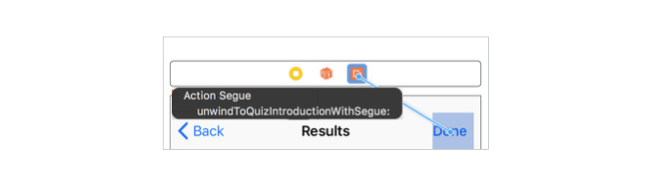

「Now when the player taps the Done button, the unwind segue will dismiss the view controllers that were created after the IntroductionViewController was displayed. This includes both the QuestionViewController and the ResultsViewController. 」

Wrapup

「Congratulations on building a custom personality quiz app for iOS!」

「This project was intense, and there was a lot going on with the interface. If you struggled to create stack views, add constraints, create outlets, or modify the attributes of view and controls, take some time to practice Interface Builder. It's your most valuable tool for building apps—and will reduce a lot of code you'd have to write if you created the interface programmatically. 」

「If you had any issues with the Swift code, remember that you can always refer to the Xcode documentation for additional information about methods and properties—or refer to the previous unit that covered Swift syntax and data types.」

### Stretch Goals

「Would you like to extend your personality quiz further? Are there steps you'd like to improve on? Here are some ideas that will make the questions more dynamic and add replay value to your app: 」

* Allow the player to choose between multiple personality quizzes from the introduction screen. 
* Randomize the order in which the questions are presented, as well as the order of the answers.
* Allow single-answer and multiple-answer questions to have a dynamic number of answers, rather than always four. Hint: Rather than creating the controls in Interface Builder, you'll need to add/remove labels and controls from stack views programmatically.

## Summary

「Nice work! This unit covered a lot of ground. 」

「You've learned how to work with optional data in Swift. You've also learned about navigation hierarchies and how to build simple workflows using tabs and navigation stacks. 」

「With your working knowledge of Xcode, Swift, and UIKit, there are many apps that you can build! In the next unit, you'll level up your UIKit experience by learning about table views, and tie together your skills to build an app that allows the user to view, enter, and save information.」

