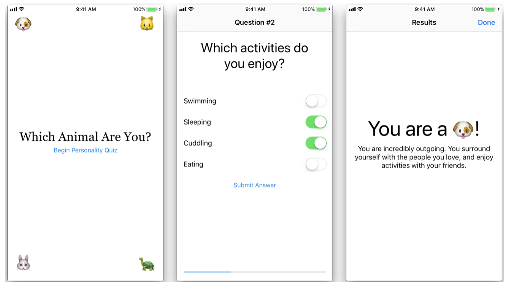

# Guided Project: Personality Quiz

  
In this unit, you learned about the UIKit framework and its controls. You also learned how to manage the position and size of views and controls using Auto Layout and stack views, while managing the flow of your app using navigation and tab controllers. Now you'll combine all that knowledge to build an app.

For this guided project, you'll create a personality quiz. Maybe you've seen this type of game before. Players are presented with a light-hearted topic and answer questions that align them to a particular outcome. Here are some examples of personality quiz topics: 

1. What animal are you? 
2. What country should you visit next? 
3. Which Apple product are you? 

There are no correct answers to quiz questions. Answers are purely subjective, and their results don't even have to be logical. For example, suppose you design a quiz called "What country should you visit next?" You could pose the question "What is your favorite color?" and decide that the answer "green" aligns to Italy and not to France. Other questions and answers might make more sense. If the player prefers sushi over pasta, you could award points for Japan instead of for Italy. 

This guided project will use "Which animal are you?" as the quiz topic. The four possible outcomes are: dog, cat, rabbit, and turtle. But if you prefer to choose your own topic and outcomes, go ahead. As long as you're following the steps in the project, any topic is fine. You'll learn more if you're having a good time. 

## Part One—Project Planning 

Rather than diving directly into Interface Builder or Swift, it's important to think about the goals and requirements of your personality quiz. Who's your target audience? Maybe you have a topic in mind, but what features will the quiz include? What models and views will you need to accomplish those features? 

「If you try to dig into writing code before you've thought through those questions, you'll probably end up rewriting or throwing away a lot of work. Spend some time now to plan your project and consider how best to approach it. 」

### Features

「What features are required to produce a fun personality quiz? Since this is probably your first app of this type, keep the list short. At a minimum, the app should accomplish three main goals: 」

1. Introduce the player to the quiz.
2. Present questions and answers
3. Display the results.

### Workflow

「With those three goals in mind, try to imagine your app as a series of related views. Each feature is very distinct from the other two, so each deserves its own screen. Some type of input will move the player from one feature to the next. For example, you can include a "Begin Quiz" button to move the player from the introduction to the questions, and answering the final question can transition to displaying the results. For the purposes of this project, you'll need at least three view controllers—one to present each of the three features. 」

「Did you also think about presenting a new view controller for each question? That's not actually necessary. In earlier lessons, you learned about two methods of presenting view controllers—modally or with a push onto a navigation stack. A modally presented screen typically includes a way to be dismissed, and any new view controller you push on a navigation controller has a Back button in the upper-left corner. In either case, there's always an implied method of dismissal. 」

「What would happen if you had separate view controllers for each question? Imagine a player is on the ninth question and wants to return to the third question. If you had a view controller for every question, they would have to dismiss six view controllers to go back. That's ok, but then they'd have to answer the questions in between—all over again—to return to the ninth question. 」

「n this project, you'll update a single screen that can present all your questions, rather than presenting questions on separate screens.」

### Controllers

「Every UIViewController subclass you create is, in fact, a controller. A view controller uses the data model you've defined to control the view that's displayed on the screen. As your apps grow in complexity, you can create additional controllers to manage the model data, freeing up the view controller to focus only on view-related code. However, since this personality quiz has just three screens that contain very simple content, your view controllers can handle managing the data. 」

### Views

「Depending on your quiz topic and the questions you want to ask, your personality quiz may need different input controls. Consider the following questions: 」

* Which food do you like the most? 
* Which of the following foods do you like?
* How much do you like this particular food? 

「The first question is a multiple-choice question, where only one answer is valid. For this question, you could use a button for each food. The second question can have zero or more answers. You could use switches so that the player can select as many foods as they like, as well as a button to submit their choices. The third question might involve a 1-to-10 scale using a slider. 」

「As you can see, the type of question dictates the controls that will be displayed onscreen. With a single view controller for all the questions and answers in your quiz, you'll want to display only the buttons, switches, slider, and/or labels that match the current question. The simplest and best way to do this is to group the controls within a view that corresponds to the question type. The appropriate view—for single-answer, multiple-answer, or ranged response—can then be shown or hidden. 」

### Models

「What type of data do you need for a personality quiz? At first, you might consider creating an array of strings to hold your questions, but where would you store the answers? A better idea would be to create a Question struct that holds a collection of answers. The collection of answers also needs to be more than an array of strings, because each answer will correspond to one of the quiz outcomes. At the very least, you'll want to include a Question struct, an Answer struct, and some sort of result type. 」

「Consider the result type. In a personality quiz, an answer can correspond to only one outcome. For example, in the animal quiz, the result will never be a dog and a cat; it will be one or the other. This is the perfect use case for an enumeration. In the same way that a Direction enumeration might have north, south, east, and west cases, the AnimalType can be dog, cat, rabbit, or turtle. If you've forgotten the details of using an enum, take a fresh look at the "Enumerations" lesson in Unit 2. 」

### Quick Overview

Now that you've analyzed which components you'll need, it's probably easier to see how the project will come together. You'll use three view controllers for your quiz:

* The first is an introduction screen with information about the quiz and a button to begin. 
* The second view controller displays a question and several answers, and manages the responses. This view controller is refreshed for each question, and depending on what kind of question you ask, the right controls will be displayed. 
* 「The third view controller tallies up the answers and presents the final outcome. This result can be dismissed, allowing another player to start the quiz from the first view controller. 」

